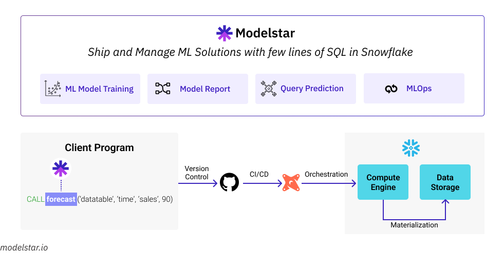

# Hi there, this is <a href="https://modelstar.io/" style="color: #AF3BEA;"> Modelstar</a> 👋

ModelStar is the easiest way to ship and manage machine learning solutions inside Snowflake, with only a few lines of SQL.

## Modelstar is for the modern data stack



## Who are the users?

-   Snowflake and DBT users.
-   Anyone who knows basic SQL.
-   Analyst, data engineers.

## Why we build Modelstar?

Modelstar is our attempt to simplify ML for analysts. Our design philosophy is: **Data is the most critical component in ML, so shipping ML solutions should be as easy as creating data objects.**

## Installation

To get started with Modelstar, install the Modelstar Python package into your local Python environment.

```shell
$ pip install modelstar
```

It's recommended to install `modelstar` within a Python virtual environment using `pyenv`, `virtualenv`, or `poetry`.

For a complete quickstart guide visit [**Modelstar-Quickstart**](https://modelstar.io/docs/quickstar)

## Tutorials

-   [**Forecast Sales inside Snowflake with 1 Line of SQL**](https://modelstar.io/docs/tutorials/sales-forecasting-inside-snowflake)